<div align="center">



<br/>

<p align="center">
  <a href="https://zaheerabbasorakzai.site"></a>
  <a href="https://www.linkedin.com/in/zaheerabbasorakzai"></a>
  <a href="https://huggingface.co/abbasorakzai777"></a>
  <a href="https://www.kaggle.com/"></a>
  <a href="mailto:zaheerabbaspattan@gmail.com"></a>
</p>

<br/>



<br/>

</div>

---

<div align="center">

## 🎯 Elite Overview

</div>

```yaml
profile:
  name: "Zaheer Abbas"
  role: "AI/ML Engineer"
  status: "🟢 Available for Elite Opportunities"
  
education:
  degree: "B.S. Computer Science"
  institution: "COMSATS University Islamabad"
  graduation: "January 2026"
  
expertise:
  core:
    - "Applied Machine Learning & Deep Learning"
    - "Large Language Models & Agentic AI"
    - "Computer Vision & Explainable AI"
    - "Hybrid RAG & Multi-Agent Systems"
  
  engineering:
    - "Full-Stack Development (React, FastAPI, Flask)"
    - "Mobile Engineering (Flutter, Kotlin)"
    - "MLOps & Model Deployment"
    - "API Design & Microservices"

experience:
  professional_years: 4
  freelance_years: 2
  repositories: "45+ production-ready"
  
mindset: "Ship models, APIs, and deployed applications — not research prototypes."
```

---

<div align="center">

## ⚡ What Makes Me Elite

</div>

<table>
<tr>
<td width="33%" valign="top" align="center">

### 🧠 **Machine Learning Mastery**

**Advanced Algorithms**
- Gradient Boosting, XGBoost, LightGBM
- LSTM/GRU for time-series
- ARIMA/GARCH forecasting
- Transfer Learning (VGG16, MobileNetV2)
- YOLOv8 object detection

**Explainable AI**
- Grad-CAM visualization
- SHAP/LIME interpretation
- Feature importance analysis

**Computer Vision**
- Medical imaging (CT/MRI)
- Object detection & tracking
- Image classification & segmentation

</td>
<td width="34%" valign="top" align="center">

### 🤖 **LLM & Agentic Systems**

**Advanced RAG**
- Hybrid retrieval (BM25 + Dense)
- Reciprocal Rank Fusion (RRF)
- Context precision optimization
- Multi-modal embeddings

**Multi-Agent Orchestration**
- LangChain & LangGraph
- CrewAI systems
- Typed tool calling
- Schema validation

**Production LLM**
- PII sanitization (GDPR/CCPA)
- DPO data curation
- Prompt engineering
- Fine-tuning workflows

</td>
<td width="33%" valign="top" align="center">

### 💻 **Full-Stack Excellence**

**Backend Engineering**
- FastAPI & Flask REST APIs
- SQLAlchemy ORM
- JWT authentication
- PostgreSQL & MongoDB

**Frontend Mastery**
- React 19 + TypeScript
- Vite + Tailwind CSS
- State management (Context, Zustand)
- Responsive design

**Mobile Development**
- Flutter/Dart
- Kotlin + Jetpack Compose
- Firebase integration
- Cross-platform (6 targets)

**DevOps**
- Docker & Nginx
- Hugging Face Spaces
- CI/CD pipelines

</td>
</tr>
</table>

---

<div align="center">

## 🚀 Flagship Projects

</div>

### 🎓 **Academic Excellence**

<table>
<tr>
<td width="50%" valign="top">

#### 📖 **AI Hadith Authentication System**
> *Final-year capstone · Flask · MongoDB · Docker · NLP*

**Elite Features:**
- 🎯 **34,000+ narrations** across 4 authenticity classes
- 🔄 **Three-tier inference** with confidence scoring
- 🌐 Bilingual (Arabic/English) interface
- 📸 OCR & ASR input processing
- 🐳 Dockerized with Nginx reverse proxy

**Tech Stack:** Flask, MongoDB, Hugging Face Transformers, Tesseract OCR, Docker

</td>
<td width="50%" valign="top">

#### 🏙️ **AI Urban Nexus: Smart City Platform**
> *Final-year capstone · Flutter · ML Backend · Firebase*

**Elite Features:**
- 📊 **99.55% weighted F1** on traffic classification
- 🚗 Stolen vehicle recognition system
- ⚡ Energy demand forecasting (LSTM)
- 🗺️ Crime-aware route planning
- 📱 Real-time FCM alerts
- 📈 Role-gated analytics dashboard

**Tech Stack:** Flutter, XGBoost, LSTM, Firebase, Hugging Face

</td>
</tr>
</table>

### 🔬 **Research & Innovation**

<table>
<tr>
<td width="50%" valign="top">

#### 🧬 **[AI Kidney Tumor Deep Classifier](https://github.com/ZaheerAbbasOrakzai/AI-KidneyTumor-DeepClassifier-v1.0)**
> *Medical AI · Transfer Learning · Explainable AI*

**Innovation:**
- 🔬 VGG16 transfer learning on CT scans
- 🎨 **Grad-CAM saliency heatmaps** for interpretability
- 📄 Automated PDF report generation
- 🌐 Streamlit inference interface

**Impact:** Clinical decision support with visual explanations

**Tech Stack:** TensorFlow, Keras, Grad-CAM, Streamlit

</td>
<td width="50%" valign="top">

#### 📈 **[AI Gold Price Forecasting System](https://github.com/ZaheerAbbasOrakzai/AI-GoldPrice-ForecastingSystem-v1.0)**
> *Financial ML · Ensemble Models · REST API*

**Innovation:**
- 📊 Ensemble: XGBoost + Gradient Boosting
- 💡 **5-factor shock simulator** (inflation, USD, oil, rates, silver)
- 📉 Plotly interactive visualizations
- 🔌 REST endpoints: `/predict`, `/api/metrics`, `/health`

**Impact:** Economic scenario modeling for traders

**Tech Stack:** Flask, XGBoost, Scikit-learn, Plotly

</td>
</tr>
</table>

### 🧪 **Deep Learning Research**

<table>
<tr>
<td width="50%" valign="top">

#### 🔬 **[Transformer Internals Lab](https://github.com/ZaheerAbbasOrakzai/transformer-internals-lab)**
> *Mechanistic Interpretability · Research*

**Deep Research:**
- 🔍 Attention head visualization & ablation
- 🧠 Residual stream tracing
- 🔎 **Logit Lens** analysis
- 📊 Token-level attribution

**Contribution:** Understanding transformer black box

**Tech Stack:** PyTorch, Transformers, Plotly

</td>
<td width="50%" valign="top">

#### ⚙️ **[ML From Scratch Plus](https://github.com/ZaheerAbbasOrakzai/ml-from-scratch-plus)**
> *Educational · Pure Python Implementation*

**Elite Implementation:**
- 🧮 **Reverse-mode autograd** (computational DAG)
- 🏗️ Modular layer architecture
- 🎯 Optimizers: SGD, RMSprop, Adam
- 📚 Zero framework dependencies (pure NumPy)

**Purpose:** Deep understanding of ML fundamentals

**Tech Stack:** Python, NumPy (no frameworks)

</td>
</tr>
</table>

### 🤖 **LLM & Agentic Systems**

<table>
<tr>
<td width="50%" valign="top">

#### 🕸️ **[AgentMesh](https://github.com/ZaheerAbbasOrakzai/AgentMesh)**
> *Multi-Agent Orchestration · LangChain · CrewAI*

**Elite Architecture:**
- 🔧 **Typed, schema-validated tool dispatch**
- 🤝 Multi-agent collaboration workflows
- 🔄 State management & handoffs
- 📝 Structured output parsing

**Use Cases:** Complex task decomposition, parallel execution

**Tech Stack:** LangChain, CrewAI, Pydantic

</td>
<td width="50%" valign="top">

#### 🔍 **[Hybrid RAG Eval](https://github.com/ZaheerAbbasOrakzai/Hybrid-RAG-Eval)**
> *Advanced Retrieval · Evaluation Framework*

**Innovation:**
- 🎯 **Hybrid retrieval:** BM25 + Dense + RRF
- 📊 Metrics: Context precision, recall, faithfulness
- 🔬 Ablation studies on retrieval strategies
- 📈 Benchmark suite

**Impact:** Production-grade RAG systems

**Tech Stack:** LangChain, ChromaDB, BM25, RAGAS

</td>
</tr>
</table>

### 🛡️ **Security & Data Engineering**

<table>
<tr>
<td width="50%" valign="top">

#### 🛡️ **[VaultGuard](https://github.com/ZaheerAbbasOrakzai/VaultGuard)**
> *PII Sanitization Agent · GDPR/CCPA Compliant*

**Security First:**
- 🔒 Fail-closed PII detection
- 🌍 Multi-language support
- ✅ Regex + NER + LLM validation
- 📋 Compliance reporting

**Tech Stack:** spaCy, Presidio, GPT-4

</td>
<td width="50%" valign="top">

#### 🔨 **[DataForge-LLM](https://github.com/ZaheerAbbasOrakzai/DataForge-LLM)**
> *Synthetic Data Generation · DPO Pipeline*

**Data Excellence:**
- 🎲 Instruction data synthesis
- ⚖️ DPO-ready preference pairs
- 🔄 Quality filtering pipeline
- 📊 Diversity metrics

**Tech Stack:** OpenAI API, Anthropic Claude

</td>
</tr>
</table>

### 💬 **Mobile & Security**

<table>
<tr>
<td width="50%" valign="top">

#### 📱 **[Meshline](https://github.com/ZaheerAbbasOrakzai/Meshline)**
> *Offline Bluetooth Mesh Messenger · Kotlin*

**Security Innovation:**
- 🔐 ECDH key exchange
- 🔒 AES-256-GCM encryption
- 📡 Bluetooth mesh networking
- 🚫 Zero-server architecture

**Use Case:** Privacy-first communication

**Tech Stack:** Kotlin, Android BLE, Jetpack Compose

</td>
<td width="50%" valign="top">

#### 🩺 **[Health & Diet Classifier](https://huggingface.co/spaces/abbasorakzai777/health-diet-classifier)**
> *Production ML · Hugging Face Space*

**Performance:**
- 🎯 **99.97% test accuracy**
- 📊 F1 score: 0.9997
- 🌐 Public inference API
- ⚡ Real-time predictions

**Tech Stack:** Gradient Boosting, Streamlit, HF Spaces

</td>
</tr>
</table>

<details>
<summary><b>🎨 View More Projects (Full-Stack, Mobile & Agentic)</b></summary>

<br/>

### **Full-Stack Applications**

| Project | Tech Stack | Features |
|---------|-----------|----------|
| **Personal Financial Tracker** | FastAPI + React 19 + TypeScript | JWT auth (bcrypt), budget alerts, Recharts dashboards, SQLAlchemy ORM |
| **Health Hub** | React + Groq (Llama 3.3 / Qwen) | Rate-limited AI chat, exponential backoff, Firebase RBAC |
| **Salon Booking System** | Flutter + Firebase | Riverpod state, Cloudinary media, 6 platform targets |
| **Events Management** | Flutter + Firebase | Real-time sync, role-based access, push notifications |

### **Market Forecasting**

| Project | Tech Stack | Features |
|---------|-----------|----------|
| **Market Forecast Ensemble** | GRU + XGBoost + ARIMA/GARCH | Walk-forward validation, ensemble voting, backtesting |
| **Crypto Price Predictor** | LSTM + Attention | Sentiment analysis, technical indicators, multi-timeframe |

### **Agentic AI Suite**

| Agent | Purpose | Tech |
|-------|---------|------|
| **Sharia Finance Assistant** | Islamic banking compliance | RAG + Fatwas database |
| **Aegis Code Linter** | Intelligent code review | AST parsing + GPT-4 |
| **QueryForge** | SQL generation from natural language | Text-to-SQL with validation |
| **ScholarSync** | Research paper summarization | Multi-document RAG |
| **SocraticAI** | Educational tutor | Socratic questioning LLM |
| **MarketMind** | Market research agent | Web scraping + analysis |
| **TalentScan** | Resume screening | NER + semantic matching |
| **TriageAI** | Medical triage assistant | Symptom checker + decision tree |
| **MinuteMind** | Meeting transcription & summary | Whisper + GPT-4 |

### **Developer Tooling**

| Tool | Purpose | Tech |
|------|---------|------|
| **DocSynth** | Auto-generate documentation | Code analysis + GPT-4 |
| **TestForge** | AI test generation | Coverage analysis + synthesis |
| **Autonomous Agent Framework** | Custom agent builder | LangGraph + tools registry |

</details>

---

<div align="center">

## 🏗️ Elite Development Workflow

```mermaid
%%{init: {'theme':'dark', 'themeVariables': { 'primaryColor':'#22D3EE', 'primaryTextColor':'#fff', 'primaryBorderColor':'#A855F7', 'lineColor':'#C084FC', 'secondaryColor':'#1E293B', 'tertiaryColor':'#0F172A'}}}%%
flowchart LR
    A[📊 Data & EDA] --> B[🧪 Train & Evaluate]
    B --> C[🎯 Model Optimization]
    C --> D[🔌 API<br/>FastAPI / Flask]
    D --> E[🐳 Container<br/>Docker / Nginx]
    E --> F[🚀 Deploy<br/>HF Spaces / Cloud]
    F --> G[💻 Frontend<br/>React / Flutter]
    G -.fallback layer.-> D
    
    style A fill:#1E293B,stroke:#22D3EE,stroke-width:3px
    style B fill:#1E293B,stroke:#A855F7,stroke-width:3px
    style C fill:#1E293B,stroke:#F472B6,stroke-width:3px
    style D fill:#1E293B,stroke:#34D399,stroke-width:3px
    style E fill:#1E293B,stroke:#FBBF24,stroke-width:3px
    style F fill:#1E293B,stroke:#8B5CF6,stroke-width:3px
    style G fill:#1E293B,stroke:#06B6D4,stroke-width:3px
```

</div>



**Production-First Principles:**
- ✅ Confidence scoring on every prediction
- ✅ Tiered fallback mechanisms (3+ layers)
- ✅ Typed schemas (Pydantic validation)
- ✅ Containerized deployment (Docker + Nginx)
- ✅ Comprehensive documentation
- ✅ Health check endpoints
- ✅ Error handling & logging

---

<div align="center">

## 🧰 Elite Tech Arsenal

</div>

### **🤖 Machine Learning & AI**

<p align="center">


</p>

### **🦾 LLM & Agentic AI**

<p align="center">


</p>

### **🌐 Backend & APIs**

<p align="center">


</p>

### **💻 Frontend & Mobile**

<p align="center">


</p>

### **🗄️ Databases**

<p align="center">


</p>

### **🚀 DevOps & Cloud**

<p align="center">


</p>

---

<div align="center">

## 💼 Elite Experience

</div>

| 📅 Period | 🏢 Role & Organization | 🎯 Key Achievements |
|-----------|------------------------|---------------------|
| **2024 – Present** | **Freelance AI/ML & Data Engineer**<br/>*Upwork · Freelancer.com · PeoplePerHour* | ✨ End-to-end ML delivery for international clients<br/>📊 Data cleaning, model training, API development<br/>🚀 Hugging Face deployment & documentation<br/>⭐ 5-star ratings, repeat clients |
| **Jun – Jul 2025** | **AI/ML Intern**<br/>*Certura Technologies* | 🤖 Shipped 3 production Streamlit tools<br/>💬 NLP FAQ chatbot (embeddings + semantic search)<br/>🖼️ MobileNetV2 image classifier (bulk ZIP support)<br/>📝 spaCy + TextBlob text summarizer |
| **May 2024 – Present** | **Ambassador**<br/>*Paklaunch* | 🎓 Completed certified 3-month internship (May–Aug 2024)<br/>🌍 Ongoing community outreach & mentorship<br/>📚 Workshop facilitation on AI/ML topics |

### 📜 **Certifications**

<p align="center">


</p>

---

<div align="center">

## 📊 Elite GitHub Analytics

</div>

<p align="center">


</p>

<p align="center">

</p>

<p align="center">

</p>

---

<div align="center">

## 🤝 Let's Build Something Elite

</div>

<div align="center">

**🎯 Open to Elite Opportunities:**
- 🧠 AI/ML Engineering Roles
- 🤖 LLM & Agentic Systems Development
- 🌐 Full-Stack AI Applications
- 💼 High-Value Freelance Projects

**💡 What I Bring:**
- ✅ Production-ready code, not prototypes
- ✅ End-to-end ownership (data → deployment)
- ✅ Clear documentation & communication
- ✅ Deadline-driven delivery

</div>

<br/>

<div align="center">

<a href="mailto:zaheerabbaspattan@gmail.com">

</a>
<br/><br/>
<a href="https://zaheerabbasorakzai.site">

</a>

</div>

<br/>


---

<div align="center">

### ⭐ If you find my work valuable, consider starring my repositories!

<sub>**© 2026 Zaheer Abbas • Crafted with ❤️ and elite precision**</sub>

</div>
